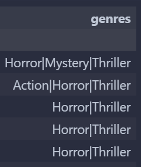
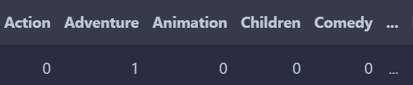
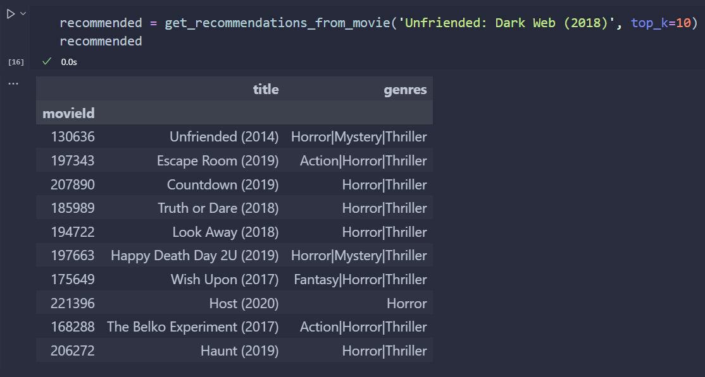
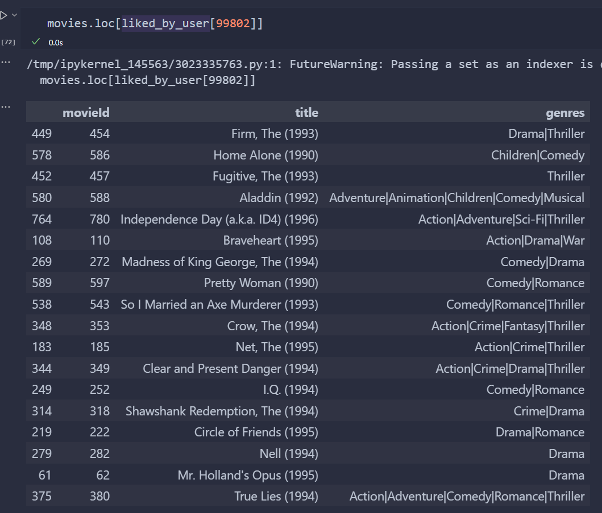
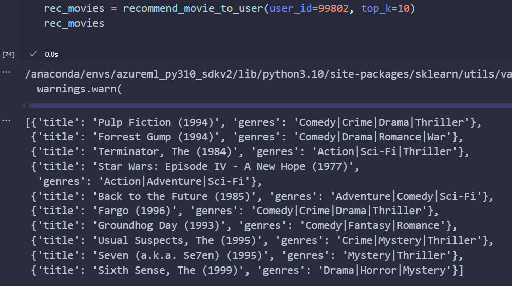
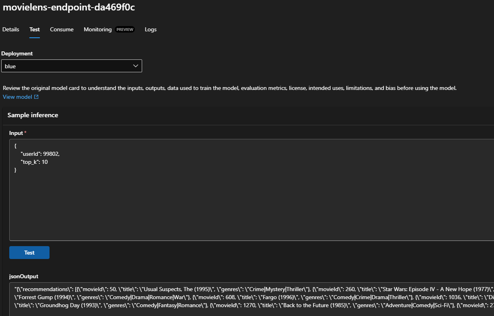

# Azure MovieLens32M Movie Recommender System

Movie Recommender System built in Azure ML for recommending movies to user based on user's history of liked movies. Trained on [MovieLens32M dataset](https://grouplens.org/datasets/movielens/32m/).

## Pipeline steps

The `main.py` script/pipeline consists of the following workflow:

**Ingest**:
- Fetch and read the data from the blob in Azure Storage into 2 DataFrames: `ratings` and `movies`.

**Feature engineering**:
- One-hot encode genres.




- Drop column `timestamp` from `ratings`.
- Merge `ratings` and `movies` to create 1 unified DataFrame.
- Randomly sample 100,000 users (~50% of total) and retain only their ratings. This is done due to memory overload and Out Of Memory errors during job execution on Azure ML.
- Create binary column `liked`: Iterate rows, set to '1' if `rating` >= 3, else '0'
- Create column `split`, use custom hash to randomly (50% chance) set it's value to 'train' or 'test', essentially splitting into train test sets manually.
- Encode `userId`, `movieId` into `userId_enc` and `movieId_enc` respectfully.
- Create a Compressed Sparse Row `X_train` with `X_train[userId_enc][movieId_enc]` being '1' if user liked the movie, else '0'
- Take `X_train.T` and convert to CSR, giving us `X_movies`, which we also normalize.

**Training**: Initially there was a `V_train` CSR matrix being computed, `V_train[userId_enc][movieId_enc]` represented how similar a movie was to a user's history of liked movies, using cosine similarity. This takes an *obscene* amount of time to compute and the storage required is also nothing to joke about. With around 200,000 unique users, and 70,000 unique movies, this would require (200,000x70,000) = **14 billion** dot products across sparse row vectors, meaning training time could easily last up to couple days. Instead, NearestNeigbours with cosine metric was used with K=100.

- Using the calculated distances from NearestNeighbors, we can extract the similarities by doing `1.0 - dist`, using that logic we build up 2 arrays, `indices` (movie indices), `sims` (similarities)
- From both arrays we drop first column, since movie X's nearest neighbor is movie X (itself) with a distance of 0, and similarity of 1.

**Evaluate**: The evaluation is executed on ~200 randomly sampled users (for time constraints), workflow process is as follows:

- Fetch liked movies of sampled users.
- Iterate users; for user, get their liked movies and recommendations.
- Make a comparison between their liked movies and our recommendations, and evaluate the following metrics:
    - `precision`: Out of all recommended movies, how many were relevant/user liked?
    - `recall`: Out of all of user's liked movies, how many were recommended?
    - `hitrate`: To how many users did we recommend atleast 1 relevant movie?
    - `total_hits`: Total users with hits (>=1 relevant movie recommended).
    - `total_liked`: Total liked movies.

**Register, Deploy and Endpoint**:
After the above script is done running, it's time to run a job to register the model in our Azure ML environment.

```python
model_name = "movielens_recommender"
data = Input(type="uri_folder", path="azureml:movielens32m:1")

job = command(
    inputs=dict(
        data=data,
        model_name=model_name,
    ),
    code="./src/",
    command="python main.py --data ${{inputs.data}} --model_name ${{inputs.model_name}}",
    environment="movielens-recsys-env@latest",
    display_name="movielens_recommender_training_job",
)
ml_client.jobs.create_or_update(job)
```

After the model has been successfully registered, we'll create an endpoint and deploy the model.
```python
endpoint_name = f'movielens-endpoint-{str(uuid.uuid4())[:8]}'

endpoint = ManagedOnlineEndpoint(
    name=endpoint_name,
    auth_mode="key",
)

model_name = "movielens_recommender"

latest_model_version = max(
    [int(m.version) for m in ml_client.models.list(name=model_name)]
)

ml_client.online_endpoints.begin_create_or_update(endpoint).result()
model = ml_client.models.get(name=model_name, version=latest_model_version)
deployment = ManagedOnlineDeployment(
    name="blue",
    endpoint_name=endpoint_name,
    model=model,
    code_path="./src",
    environment="movielens-recsys-env@latest",
    scoring_script="score.py",
    instance_type="Standard_E2s_v3",
    instance_count=1,
)

ml_client.online_deployments.begin_create_or_update(deployment).result()

endpoint.traffic = {"blue": 100}
ml_client.online_endpoints.begin_create_or_update(endpoint).result()
```
## Inference

In the production model, there is only 1 recommendation method, and it's based on user's history, however during experimenting with the notebook, I also created a function to recommend movies based on a specific movie.


And for the user specific recommendation, for a random user I'll show their liked movies, and the returned list of recommended movies for that user. 

- **User 99,802's liked movies**


- **User 99,802's recommended movies**

As we can see, there's a lot of similarities between genres, such as Comedy, Thriller and Drama, meaning the recommender is doing its thing.

## Endpoint inference test user 99802
